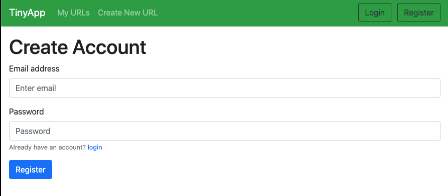
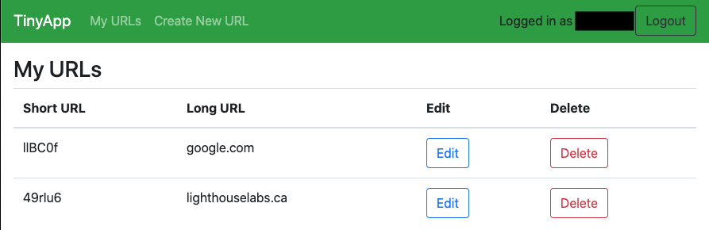

# TinyApp Project

TinyApp is a full stack web application built with Node and Express that allows users to shorten long URLs (à la bit.ly).
It stores a library of your own URLS and their associated shortened links. 

## Final Product

## Dependencies

- Node.js
- Express
- EJS
- bcrypt
- body-parser
- cookie-session

## Getting Started˚

- Install all dependencies (using the `npm install` command).
- Run the development web server using the `npx start` command.

## In the Browser
- Navigate to your server `localhost:8080/`

## Using the Application
- Create a new URL by typing it into the input box and click submit 
- View a list of your created URL under the my URL link in the nav bar
- To visit a short link click edit and click the hyper link provided as the short link
- Alternatively you may access the short link via:
 localhost:8080/u/ 'shortlinkhere'